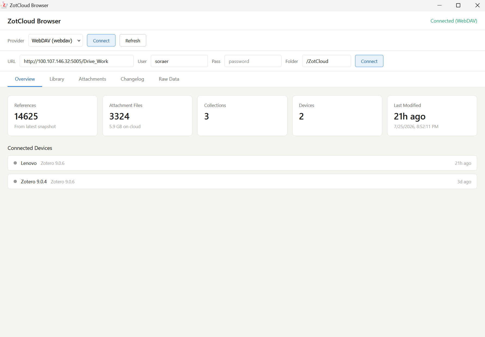
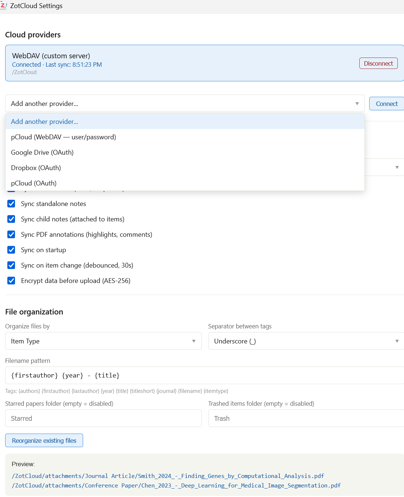
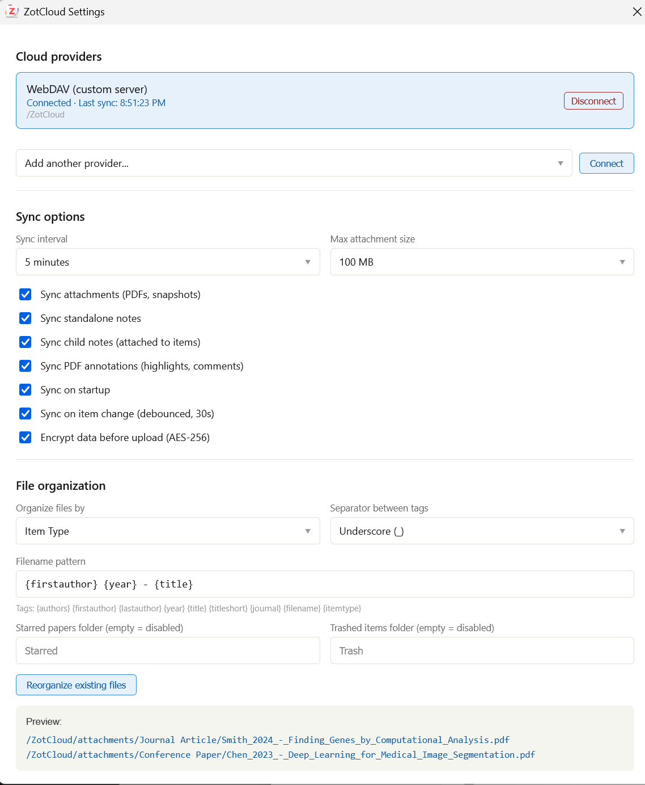

# ZotCloud for Zotero

ZotCloud synchronizes your Zotero library with your own WebDAV server or a supported cloud account.



## What it can synchronize

- Library metadata
- Attachments
- Notes
- PDF annotations

## Storage providers

ZotCloud supports WebDAV, Google Drive, Dropbox, and pCloud. You can set the synchronization interval, maximum file size, automatic startup, and how the plugin responds to local changes.



Optional AES-256 encryption protects files before upload. Naming and folder patterns can use fields such as author, year, title, journal, and item type.



The built-in browser shows files, linked Zotero items, devices, and synchronization history.

## Installation

1. Download the latest `.xpi` from [Releases](https://github.com/sorinhostiuc/zotero-zotcloud/releases/latest).
2. In Zotero, open **Tools > Plugins**.
3. Choose **Install Plugin From File**, select the `.xpi`, and restart Zotero if asked.

ZotCloud supports Zotero 7 through 9.

## Development

```bash
npm ci
npm test
npm run build
```

## License

[MIT](LICENSE)
